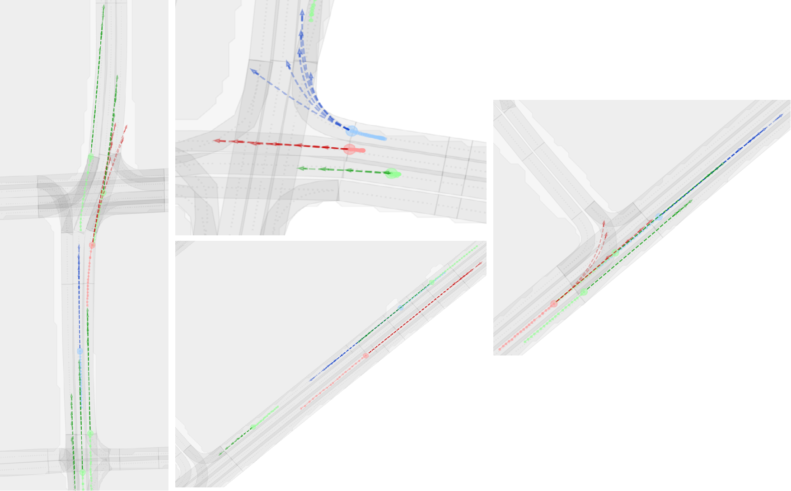

# Dynamic Relational Graph Modeling for Multi-Agent Trajectory Prediction
This is the official code implementation for manuscript "Dynamic Relational Graph Modeling for Multi-Agent Trajectory Prediction".

## Visualization



## Getting Started

### Install dependencies
- Create a new conda virtual env
```
conda create --name DRG python=3.9
conda activate DRG
```

- Install PyTorch according to your CUDA version. We use CUDA = 12.4,  PyTorch_Lighting = 2.4.0
```
conda install pytorch==1.12.0 torchvision==0.13.0 torchaudio==0.12.0 cudatoolkit=11.6 -c pytorch -c conda-forge
```

- Install Argoverse 1 APIs, please follow [argoverse-api](https://github.com/argoai/argoverse-api).

- Install other dependencies
  ```
  pip install -r requirements.txt 
  ```
### Data preparation
- Refer to [Simpl](https://github.com/HKUST-Aerial-Robotics/SIMPL)

### Train from scratch
Once you prepare the dataset.
Run `train_ddp.py`

## Acknowledgment
We would like to express sincere thanks to the authors of the following packages and tools:
- [Simpl](https://github.com/HKUST-Aerial-Robotics/SIMPL)
- [HiVT](https://github.com/ZikangZhou/HiVT)
- [LaneGCN](https://github.com/uber-research/LaneGCN/tree/master)

## License
This repository is licensed under [MIT license](https://github.com/tyfelix63/MRI/main/LICENSE).
